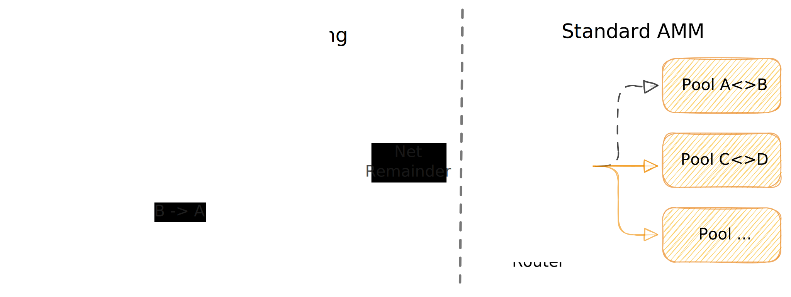

# Nettedswap

Nettedswap is a high-performance AMM DEX built on the Uniswap v3 codebase. It adds an on-chain netting layer that batches and offsets trades before they reach liquidity pools, significantly reducing slippage, mitigating MEV, and enabling massive parallel execution. 

This is a demo of a DEX engineered for parallel execution with an on-chain netting engine — delivering massive throughput, minimal slippage, and zero sandwich MEV.

*	**Faster**:  institutional grade throughput.
*	**Fairer**:  No MEV, parallel execution removes exploitable ordering.
*	**Efficient**:  liquidity only used where it matters.
*	**Scalable**:  a foundation for the next generation of DeFi.

## Problems with Existing AMM Model
Traditional AMMs like Uniswap are powerful, but their core model hasn’t evolved.
They suffer from: 
*	**Slippage**: large trades move the price against you.
*	**Liquidity Waste**: opposite trades don’t cancel out; they both hit the pool.
*	**MEV / Sandwich Attacks**: attackers insert trades before and after yours.
*	**Low Throughput**: swaps run sequentially, limiting speed.

## Why It Changes the Game

Nettedswap is fully compatible with existing Uniswap v3 interfaces but enhanced with Arcology’s concurrent library for true parallel execution. To improve liquidity efficiency and prevent MEV, it adds an on-chain netting layer that matches opposing trades before they reach the pool.

Nettedswap combines the best of both worlds — an identical user experience with zero sandwich MEV, significantly reduced slippage, and high performance. It delivers:

*	**Parallel swaps**: no exploitable “before” or “after.”
*	**Same pool netting**: opposing trades cancel internally on-chain, often skipping the pool.
*	**Net remainder only**: sends just the difference to the pool.
*	**Fully compatible**: same user experience as the standard AMM.
